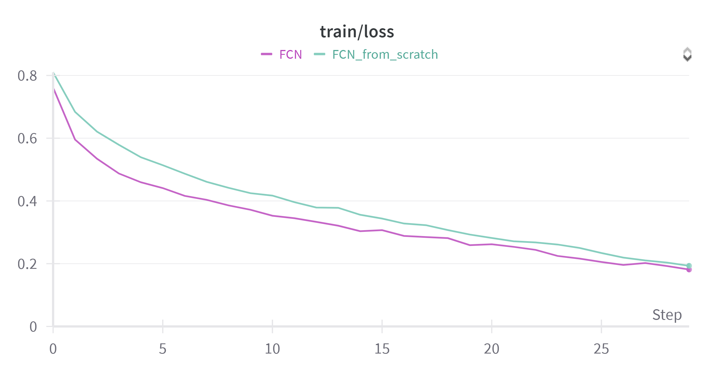
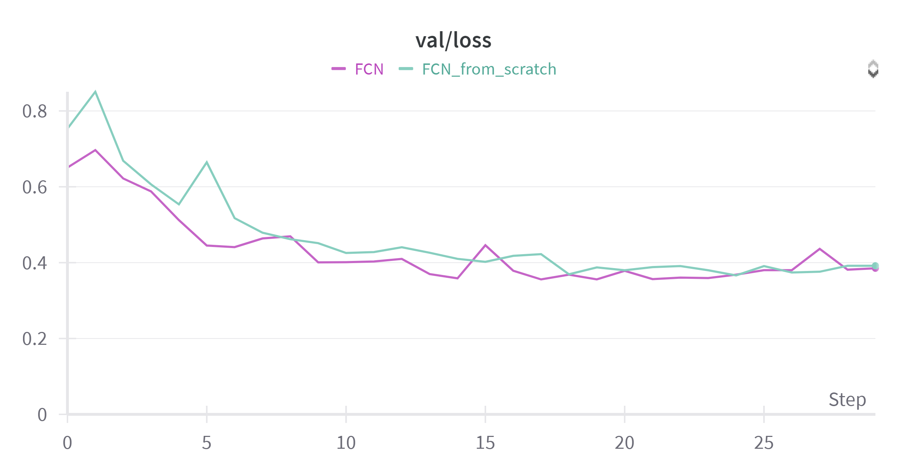
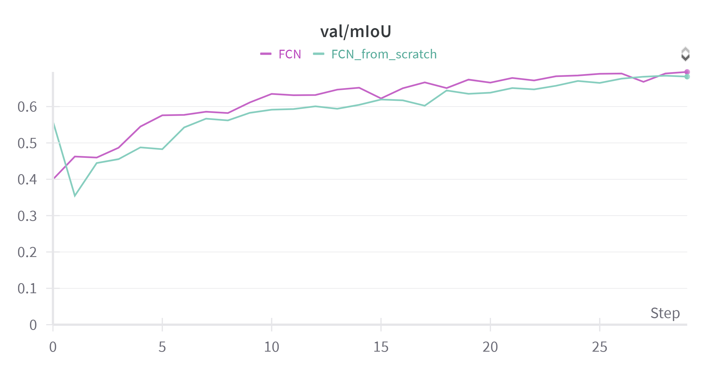
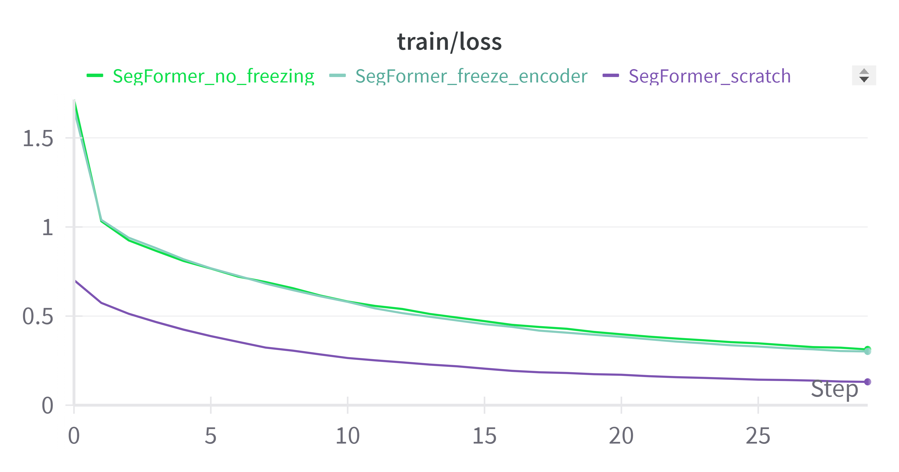
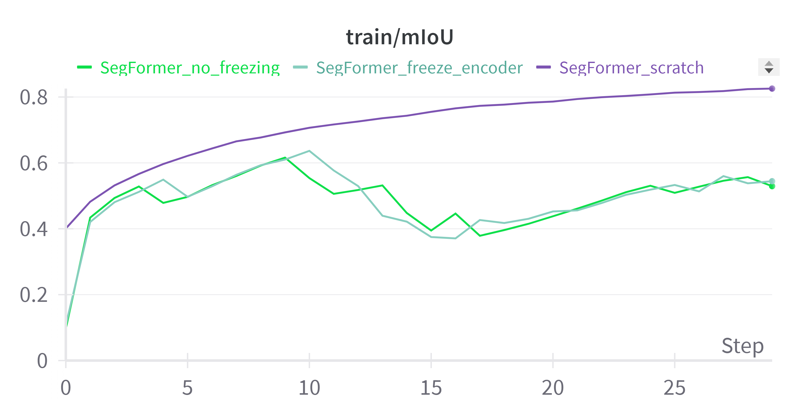
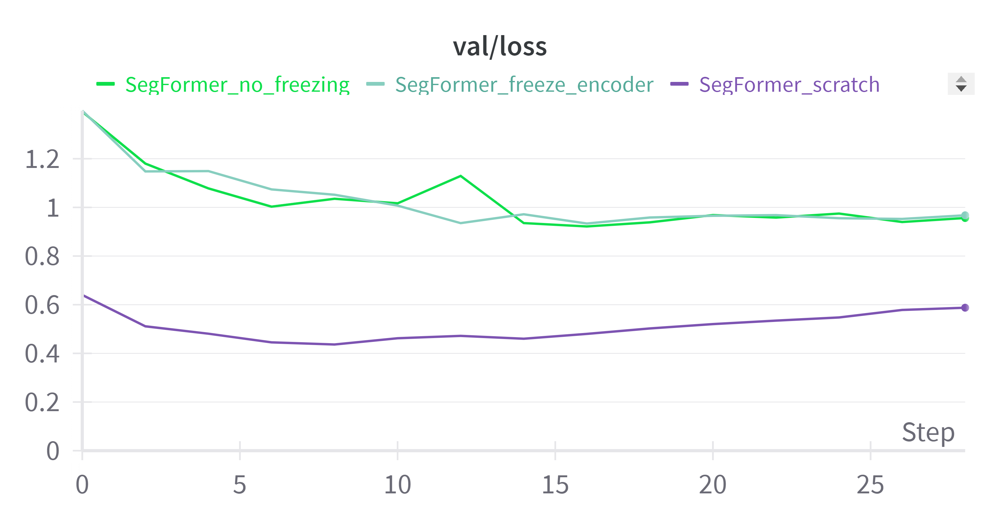
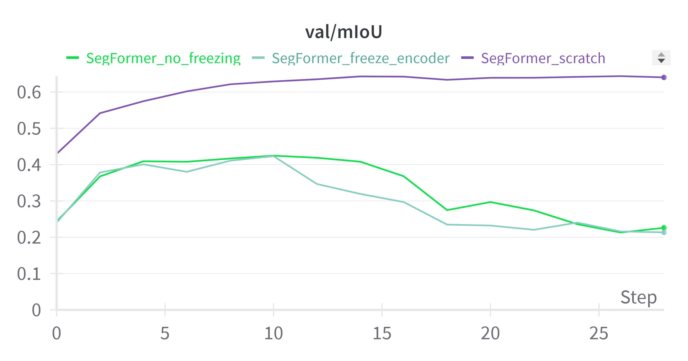

# Deep Learning for Visual Computing - Assignment 2
- [Wojciech Michaluk](https://github.com/wojo501)
- [Mariusz Nitecki](https://github.com/n1tecki)

---

## Overview

This project explores various segmentation architectures for deep learning, including Fully Convolutional Networks (FCNs), U-Net, and SegFormer. It focuses on the implementation, training, and evaluation of models for semantic segmentation tasks.

---

## Key Concepts

### Segmentation Architectures
1. **Fully Convolutional Networks (FCNs):**  
   Replace fully connected layers with convolutional layers to output spatial maps of class predictions.
   
2. **U-Net:**  
   Uses an encoder-decoder structure with skip connections, retaining spatial information for improved segmentation.
   
3. **SegFormer:**  
   A hierarchical transformer-based model that processes image patches and uses Multi-Layer Perceptrons (MLPs) for upscaling and classification.

---

## Techniques

### Downsampling and Upsampling
- **Downsampling:** Reduces spatial dimensions for computational efficiency using pooling and strided convolutions.
- **Upsampling:** Restores feature maps to original resolution using interpolation or transposed convolutions.

### Pre-training and Fine-tuning
- **Pre-training:** Uses a general dataset to learn initial features.
- **Fine-tuning:** Adapts features for specific datasets, improving performance with limited data.

---

## Experimental Results

### FCN Models
Trained on the OxfordIIITPet dataset:
- **Pre-trained Encoder vs Scratch Training:**
  - Pre-trained model showed faster convergence and higher mIoU.
  - Validation plots confirmed the advantage of pre-training.

### SegFormer Models
Fine-tuned using the OxfordIIITPet dataset:
- **Methods:**  
  - *Freezing Encoder*: Encoder weights frozen during training.  
  - *No Freezing*: Encoder weights updated during training.
  
- **Observations:**
  - "No Freezing" method showed better convergence.
  - Validation loss and mIoU plots indicated underfitting in early stages.

---

## Discussion

1. **Downsampling and Upsampling:** Essential for balancing computational load and prediction accuracy.
2. **Pre-training and Fine-tuning:** Effective for tasks with limited data, though performance varies based on dataset similarity.
3. **Challenges:** Fine-tuning can lead to underfitting when initial and target tasks differ significantly.

---

## Repository Structure

