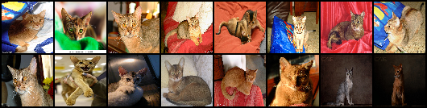
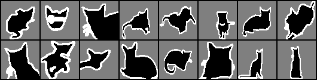
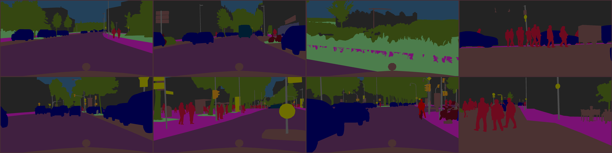
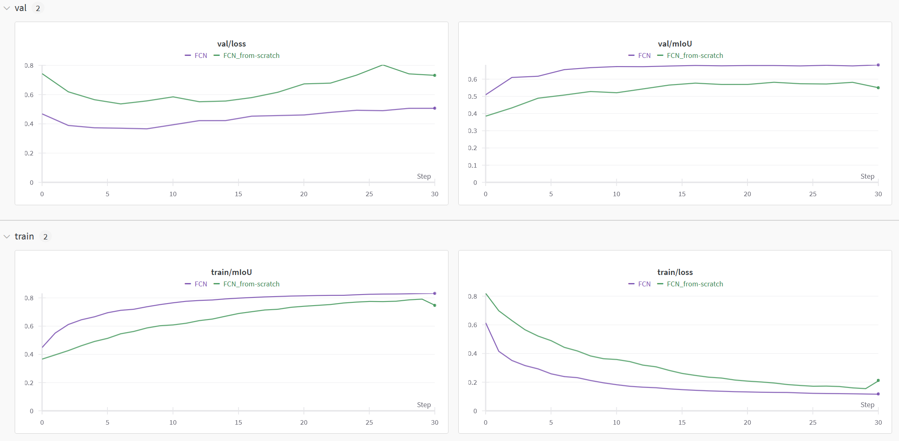
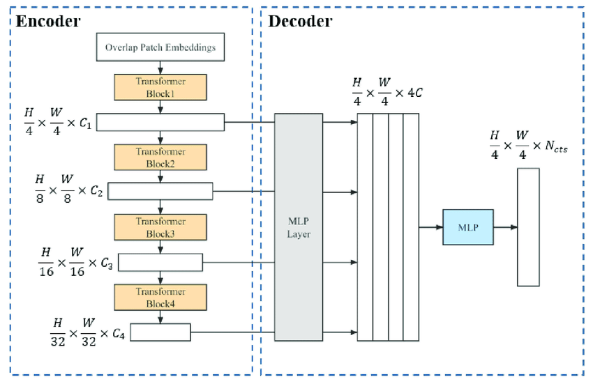
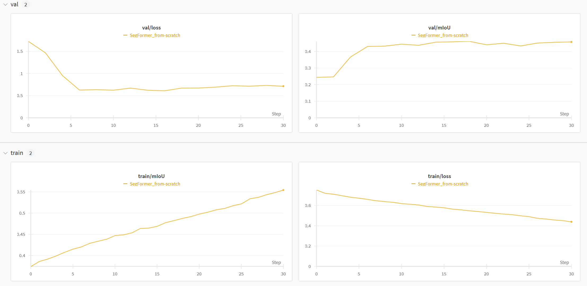
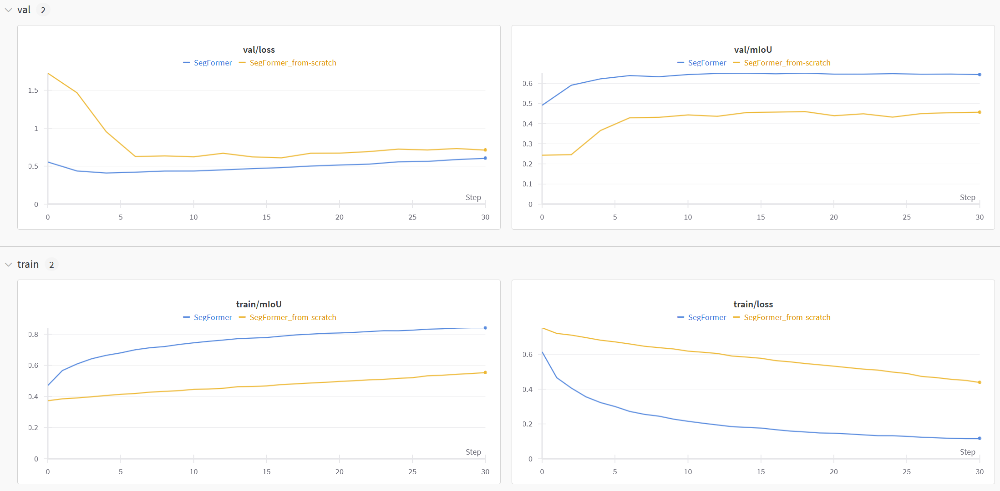

# Deep Learning for Visual Computing - Assignment 2

In the first assignment you have become familiar with a general training setup, simple dataset processing and image classification. In this assignment, assignment 2, you will get the chance to dive into image semantic segmentation, using pre-trained models and pre-train and fine-tune models yourself. 

Since assignment 1, no extra packages are necessary. 

This text or the reference code might not be without errors. If you find a significant error (not just typos but errors that affect the assignment), please contact us via [email](mailto:dlvc@cvl.tuwien.ac.at). Students who find and report such errors will get extra points.

## Part 0 - Introduction & Overview

In comparison to image classification, which gives one class for a whole image, image semantic segmentation requires one class per pixel of each image.

Familiarize yourself with the code in the folder `dlvc`. The file structure is similar to assignment 1, however with different models. Read the code and make sure that you understand what the individual classes and methods are doing. A good starting point might be the `train.py` file, to see what method or class is used for what. 

## Part 1 - Dataset
For this section you won't need to implement anything yourself but you should get an understanding of the datasets used in the exercise.
You are going to use two different datasets:
1. **OxfordIIITPet**: This is a dataset of images of pets, where the task is to correctly segment the pet, it's boundary and the background; this results into 3 different segmentation classes. we can get it directly from `pytorch` (see [here](https://pytorch.org/vision/main/generated/torchvision.datasets.OxfordIIITPet.html#torchvision.datasets.OxfordIIITPet)) and is already ready-to-use for you in the code (`dlvc/dataset/oxfordpets.py`). Note that the labels are (1,2,3) and pytorch losses etc. work with 0-based labels, don't forget to subtract 1 from the labels vector, when using the dataset. Examples of the input images:
 
and their corresponding segmentation masks: 

2. **Cityscapes**: This dataset is a collection of recorded street scenes, see the [official webpage](https://www.cityscapes-dataset.com/). 
It has 30 classes, however in our examples we will only be using 19 of them, you can have a look at the file `dlvc/dataset/cityscapes.py` to get a grasps of all classes used. We have provided a preprocessed subset of the dataset for this exercise, please download it form [here](https://tuwienacat-my.sharepoint.com/:u:/g/personal/lisa_weijler_tuwien_ac_at/EX3bC0h1yeZKi6mFCd06VT0B7rlW77ihd-HXiHraNYy-6A?e=kquIms). Since we won't use all of the labels we will have some pixels which are to be left out of the optimization as well as from the metric calculation. Those pixels have the label-value `255`. 
Examples of the input images:
 
 and their corresponding segmentation masks: 

Note: update the dataset paths in the `train.py` and `train_segformer.py` files to the place where you stored the datasets.

## Part 2 - Metrics
Implement the `SegMetrics` class (`metrics.py`), which will help us with keeping track of the metric `mean intersection over union (mIoU)`. The mIoU is one of the most important metrics for semantic segmentation. In comparison to Accuracy the IoU is not affected by class imbalances and hence a good fit for semantic segmentation given the naturally occurring class imbalances in segmentation tasks. The mIou is the average of all IoU values per class: for each class in our dataset the Iou is computed as follows,

$IoU = \frac{TP}{(TP + FP + FN)}$, 
where $TP$ stands for `true positives`, the number of pixels predicted correctly with respect to the current class we are considering, $FP$ stands for `false positives`, the number of pixels which were wrongly predicted as the class at hand, and $FN$ stands for `false negatives`, the number of pixels which should have been predicted as the class but were not. The mean IoU is then the average of all IoU calculated per class.
Consider the following confusion matrix in a multiclass problem as an example (3 classes),

| True\Prediction | A | B | C |
| --- | --- | --- | --- |
| A | AA | AB | AC|
| B | BA | BB | BC|
| C | CA | CB | CC|

the mIoU is then

$$\frac{1}{3}\left(\frac{\text{AA}}{\text{AA}+ \text{AB} +\text{AC} + \text{BA} + \text{CA}} +  \frac{\text{BB}}{\text{AB} +\text{BA}+\text{BB} + \text{BC} +\text{CB}} + \frac{\text{CC}}{\text{AC} + \text{BC} + \text{CA} +\text{CB}+\text{CC}}\right)$$

Read the doc strings and make sure to implement the specified type checks. Make sure to exclude pixels with a label-value of `255`.
## Part 3 - Training Loop

This is the same as for the previous assignment and you can reuse your code. Simply adapt the code to the new task, e.g. update the metric tracking. We also provide a reference implementation, which you can use/adapt for this assignment (`trainer_reference_impl.py`).

## Part 4 - Using Pytorch's Pre-trained Models

As in the previous exercise we will use another model provided by Pytorch but this time from the semantic segmentation [options](https://pytorch.org/vision/stable/models.html#semantic-segmentation). Have a look at the `fcn_resnet50` model and train it first from scratch and second with using pre-trained weights as model initialization for the encoder part (meaning you will have to work with the parameter `weights_backbone` not `weights`, since we have a different number of output classes compared to the dataset it was trained on, we cannot use the pre-trained weights for the `prediction head` = last layers of the model). Use the `OxfordIIITPet` dataset for this and keep track of train and validation (=test split in this case) loss and mIoU in order to be able to include those plots in the report.

For reference those are the curves gathered with a reference implementation using 30 epochs, a batchsize of 64, validation frequency of every 2nd epoch, AdamW with a learning rate of 0.001 and amsgrad=True, ExponentialLR scheduler with gamma= 0.98.

## Part 5 - SegFormer

In the lecture you covered the [SegFormer model](https://arxiv.org/abs/2105.15203), which uses 4 Transformer blocks and a lightweight decoder for segmentation tasks: 

In the folder `models` you will find all files related to the SegFormer model, with almost all of it implemented. Have a look at the code and implement the missing parts listed below as instructed in the comments. 
The main model is in the file `segformer.py` you can start from there going through the code to get an overview. (You can ignore detailed things like `weight_init` class methods or `drop out` modules etc. The main parts of the models to focus on are the encoder `MixVisionTransformer` that is using the Block module `Block` and the Patch Embedding `OverlapPatchEmbed` in `mit_transformer.py` as well as the decoder `SegFormerHead` in the `segformer_head.py` file.)
The following parts missing are to be implemented:

1. In the `Block` module in the file `mit_transformer.py` compile the forward function as instructed in the code. 
2. In the `OverlapPatchEmbed` module in the file `mit_transformer.py`in the `__init__` function fill in the missing lines as instructed. 
3. In the module `SegFormerHead` in the `forward` function fill in the missing line compiling the features from the different levels.

Bonus (max 2 pts): The self-attention used in the SegFormer differs to the standard self-attention (see paragraph `Efficient Self-Attention` in the paper, explain in the report how it differs and point out the relevant 5 lines of code in your submitted codebase.)

For reference this image shows the metrics for the SegFormer with the same parameters as stated above:

## Part 6 - Pre-train on Cityscapes, fine-tune on OxfordIIITPet 

In part 4 we have used pre-trained weights given from pytorch. In this part you will pre-train the SegFormer yourself using the `Cityscapes` dataset and then fine-tune the model for the 
`OxfordIIITPet` dataset. Note that the number of classes differs between those datasets and hence for the last layers we cannot use the pre-trained weights. Since our SegFormer model is divided into `encoder` and `decoder`, you will use the pre-trained weights for the encoder only and the decoder is always trained from-scratch. To successfully leverage the `Cityscapes` dataset for a performance boost on the OxfordIIITPet dataset follow the following steps:
1. Pre-training: Train the SegFormer using the `Cityscapes` for a couple of epochs (in the reference plots it was trained for 40 epochs with a batchsize of 16) and save the model at the end of those 40 (or less) epochs (save the state_dict as discussed in the previous exercise). Be aware that we want to exclude pixels with a label of `255` during optimization, for this simply set the parameter `ignore_index=255`, when creating the CrossEntropyLoss. 
2. Fine-tuning: Create an instance of the SegFormer model class for 3 classes. Load the state_dict of the model saved in step 1 and update the weights of the newly created SegFormer model with the loaded weights. Make sure to **only** update the weights of the encoder. (Hint: one could either iterate over the state_dict of the new model and update the values if their key in the dictionary starts with "encoder." (double check if this is the correct key, this depends on how you saved your model), or another option would be, to only save the encoder state_dict and use `model.net.encoder.load_state_dict(..)` ). Once the parameters are loaded there are two option we will try:

    **a.** Using the pre-trained weights as weight-inits: for this you just need to start the training after the encoder weights have successfully been updated with the pre-trained weights.

    **b.** Freezing the pre-trained encoder and only train the decoder: for this you need to freeze the entire encoder using `requires_grad=False` of parameters (e.g. `model.net.encoder.requires_grad_(False)`). Also make sure to give the optimizer only the necessary parameters to optimize (the decoder parameters).

Include a comparison of the SegFormer trained from scratch and with the two fine-tuning options in the report including train and validation metrics plots. 
Visualize the predicted masks of the best performing model of a couple of validation samples from the `OxfordIIITPet` (you can look at and adapt `viz_pets.py` for that).

To get additional points try different learning rates: usually a lower learning rate is used for fine-tuning. Pick one fine-tune option and compare the results of using the same learning rate as used during pre-training with the results of using a lower one (e.g. half). Discuss your findings in the report.

For reference the plot shows the SegFormer trained from scratch (Part 5) and the pre-trained SegFormer using pre-training strategy `a`:

## Report

Write a short report (3 to 4 pages) that includes your findings from your experiments and answers the following questions:
* What other architectures for segmentation apart from the SegFormer have you learned in the lecture and how do they differ from the SegFormer?
* Why are those architectures using down- and up-sampling instead of keeping the same resolution?
* What is the purpose of pre-training and fine-tuning? For which use-cases is it especially beneficial?
* What have you observed in your experiments above, how has using pre-trained weights influenced the performance and why? Do you see any differences between the two fine-tuning option of part 6?

Include the validation and train metrics plots from the experiments above and discuss the findings of your experiments conducted including the setup you were using such as optimzer, learning rate scheduler etc.
Also, as stated in part 6, include an image of the predicted segmentation mask of some (e.g. 4) test samples (=validation samples) of the `OxfordIIITPet` dataset using the best performing model of your experiments.

## Submission

Submit your assignment until **May 28th at 11pm**. To do so, create a zip archive including the report, the complete `dlvc` folder with your implementations (do not include any datasets), the `train_segformer.py`and `train.py` files. More precisely, after extracting the archive we should obtain the following:

    group_x/
        report.pdf
        train.py
        train_segformer.py
        dlvc/
            metrics.py
            ...
            datasets/
                ...
            ...

Submit the zip archive on TUWEL. Make sure you've read the general assignment information [here](https://smithers.cvl.tuwien.ac.at/lweijler/dlvc_ss24/-/blob/main/assignments/general.md?ref_type=heads) before your final submission.

## Server Usage

You may find that training is slow on your computer unless you have an Nvidia GPU with CUDA support. If so, copy the code into your home directory on the DLVC server and run it there. The login credentials will be sent out on April 16th - check your spam folder if you didn't. For details on how to run your scripts see [here](https://smithers.cvl.tuwien.ac.at/lweijler/dlvc_ss24/-/blob/main/assignments/DLVC2024Guide.pdf). For technical problems regarding our server please contact [email](mailto:dlvc-trouble@cvl.tuwien.ac.at).

We expect queues will fill up close to assignment deadlines. In this case, you might have to wait a long time before your script even starts. In order to minimize wait times, please do the following:

* Write and test your code locally on your system. If you have a decent Nvidia GPU, please train locally and don't use the servers. If you don't have such a GPU, perform training for a few epochs on the CPU to ensure that your code works. If this is the case, upload your code to our server and do a full training run there. To facilitate this process, have a variable or a runtime argument in your script that controls whether CUDA should be used. Disable this locally and enable it on the server.
* Don't schedule multiple training runs in a single job, and don't submit multiple long jobs. Be fair.
* If you want to train on the server, do so as early as possible. If everyone starts two days before the deadline, there will be long queues and your job might not finish soon enough.
